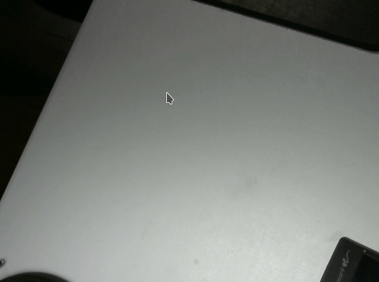

# Adaptative Motion Detection
A simple motion detection algorithm for a wide range of time scales.

>This is not a labeling technique! It does not discern differences in objects.

This simple filter is able to discern and locate small, fast-moving and slow-moving objects with the same settings. This technique can be used to locate fast flying bugs as well as slow creeping spiders.

Inspired by the video [Posy - Motion Extraction](https://youtu.be/NSS6yAMZF78?si=dd8RtlWkoxnrMcFJ) on YouTube.
| Slow-moving (spider) | Fast-moving (button) |
|--|--|
|  | |

The following image shows the underlying motion extraction using a rolling average. The gif compression makes it hard to see, but the spider (Jonathan) can be seen moving within the gray mist. The table was also shook to demonstrate the underlying motion extraction.

>Jonathan inspired this afternoon project and contributed greatly to *bugging* this code. He was unharmed and later freed along with a tasty snack. So long Jonathan.